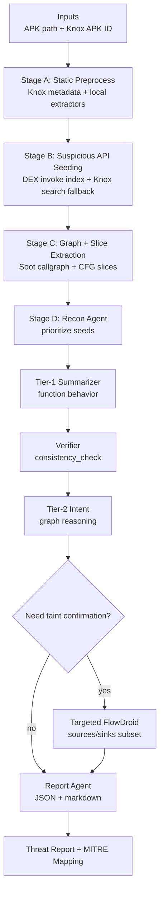

# APK Malware Analysis Agent (PoC)

LLM-assisted Android APK malware analysis pipeline aligned to LAMD: deterministic preprocessing + suspicious API seeding + structured context extraction + tiered LLM reasoning with evidence gating + targeted FlowDroid taint confirmation.

## What This Implements

- Knox Vision API client for static metadata, decompiled source access, bytecode method lookup, and APK download.
- Local static extractors (manifest, strings, certs) using androguard + ZIP parsing.
- Suspicious API catalog + DEX invocation indexing (androguard) with Knox search fallback.
- Java-based Soot extractor that exports call graph JSON and per-method CFG JSON.
- Context bundle builder + basic backward slice for seed context.
- LLM agent stubs (Recon, Tier1, Verifier, Tier2, Report) with deterministic consistency checking.
- Targeted FlowDroid execution via CLI jar + sources/sinks subset generation.
- MITRE Mobile ATT&CK mapping via local rules and optional dataset fetch.
- Artifacts are stored under `artifacts/{analysis_id}/` for traceability.

## Workflow

The pipeline has two modes:

- **Combined (default):** requires the local APK path + Knox APK ID.
- **APK-only (opt-in):** requires the local APK path only, uses JADX to decompile into a temp dir, and falls back to local source search when Knox is unavailable. The temp dir is deleted after analysis.

### Combined workflow



### APK-only workflow

```mermaid
flowchart TD
  A[Input<br/>APK path] --> B[Stage A: Local static extractors]
  B --> C[Stage A2: JADX decompile (temp dir)]
  C --> D[Stage B: Suspicious API Seeding<br/>DEX invoke index + local source search fallback]
  D --> E[Stage C: Graph + Slice Extraction<br/>Soot callgraph + CFG slices]
  E --> F[Stage D: Recon Agent<br/>prioritize seeds]
  F --> G[Tier-1 Summarizer<br/>function behavior]
  G --> H[Verifier<br/>consistency_check]
  H --> I[Tier-2 Intent<br/>graph reasoning]
  I --> J{Need taint confirmation?}
  J -- yes --> K[Targeted FlowDroid<br/>sources/sinks subset]
  J -- no --> L[Report Agent<br/>JSON + markdown]
  K --> L
  L --> M[Threat Report + MITRE Mapping]
```

High-level steps:
- Build static artifacts (manifest, permissions, strings, certs, Knox indicators).
- Seed suspicious API callsites from DEX, fall back to Knox or local source search when needed.
- Build callgraph and CFG slices for each seed and create context bundles.
- Run LLM agents (Recon → Tier1 → Verifier → Tier2) with evidence gating.
- Run FlowDroid only if Tier2 requests taint confirmation.
- Emit report with evidence supports and MITRE mappings.

## Repo Layout

- `src/apk_analyzer/`: Python pipeline and agent logic
- `java/soot-extractor/`: Java Soot extractor (Gradle)
- `config/`: settings, schemas, suspicious API catalog, SourcesAndSinks, MITRE mapping
- `scripts/`: entrypoints and helpers
- `tests/`: unit tests
- `FlowDroid/`: upstream FlowDroid repo (for CLI build)

## Requirements (Local)

- Python >= 3.10
- JDK 17 (Soot extractor + FlowDroid)
- Android SDK platforms directory (for Soot/FlowDroid)
- Maven + Gradle (to build FlowDroid CLI jar and Soot extractor)

## Quickstart (Local)

1) Install Python deps:

```bash
python -m pip install -e .
```

2) Build the Soot extractor:

```bash
gradle -p java/soot-extractor jar
```

3) Build FlowDroid CLI jar:

```bash
mvn -f FlowDroid/pom.xml -pl soot-infoflow-cmd -am package -DskipTests
```

4) Configure `config/settings.yaml`:

- `analysis.android_platforms_dir` should point to your Android SDK `platforms/` directory.
- `analysis.flowdroid_jar_path` should point to `FlowDroid/soot-infoflow-cmd/target/soot-infoflow-cmd-jar-with-dependencies.jar`.
- `analysis.soot_extractor_jar_path` should point to `java/soot-extractor/build/libs/soot-extractor.jar`.

5) Run analysis (default combined mode requires both APK path and Knox APK ID):

```bash
python -m apk_analyzer.main --apk /path/to/app.apk --knox-id <apk_id>
```

APK-only mode (opt-in):

```bash
python -m apk_analyzer.main --mode apk-only --apk /path/to/app.apk
```

Artifacts are written under `artifacts/{analysis_id}/`.

## Docker Setup (Recommended for FlowDroid/Soot)

Docker provides a consistent Ubuntu + JDK + Android SDK environment with Android platforms 25-36 preinstalled.

### First-time setup

1) Initialize submodules (FlowDroid):

```bash
git submodule update --init --recursive
```

2) Build the Docker image:

```bash
docker compose build
```

3) Bootstrap toolchain inside the container (Python deps + Soot extractor + FlowDroid jar):

```bash
docker compose run --rm aag ./scripts/docker_bootstrap.sh
```

By default this builds a **release** FlowDroid jar (v2.14.1) in a temp dir to avoid snapshot dependency issues.
To build from the submodule instead:

```bash
docker compose run --rm \
  -e FLOWDROID_BUILD_MODE=source \
  aag ./scripts/docker_bootstrap.sh
```

To override the release tag used for the temp build:

```bash
docker compose run --rm \
  -e FLOWDROID_TAG=v2.14.1 \
  aag ./scripts/docker_bootstrap.sh
```

### Run analysis (Docker)

Place APKs inside the repo (or mount a folder) so they are visible under `/workspace`:

```bash
cp /path/to/app.apk ./data/app.apk
```

APK + Knox ID:

```bash
docker compose run --rm aag \
  python -m apk_analyzer.main --apk /workspace/path/to/app.apk --knox-id <apk_id>
```

APK-only mode (JADX-based):

```bash
docker compose run --rm aag \
  python -m apk_analyzer.main --mode apk-only --apk /workspace/path/to/app.apk
```

Interactive shell:

```bash
docker compose run --rm aag
```

### Rebuild after FlowDroid changes

```bash
docker compose run --rm aag \
  mvn -f FlowDroid/pom.xml -pl soot-infoflow-cmd -am package -DskipTests
```

### Rebuild after Soot extractor changes

```bash
docker compose run --rm aag \
  gradle -p java/soot-extractor jar
```

Notes:
- The repo is mounted at `/workspace`.
- `ANDROID_SDK_ROOT` is set to `/opt/android-sdk`, and `analysis.android_platforms_dir` auto-resolves to `/opt/android-sdk/platforms` if unset.
- `jadx` is preinstalled at `/opt/jadx/bin/jadx` and available on `PATH`.
- `KNOX_BASE_URL` defaults to `http://105.145.72.82:8081/api/v1` in `docker-compose.yml` and can be overridden via env.
- Artifacts are written to `/workspace/artifacts/{analysis_id}/` on the host.

## Input Requirements

Default (combined) mode requires both:
- `--apk` path on disk
- `--knox-id` (Knox APK ID)

APK-only mode requires:
- `--apk` path on disk
- `--mode apk-only`

## Configuration

Key settings live in `config/settings.yaml`:

- `knox.base_url`: Knox Vision API base URL.
- `analysis.android_platforms_dir`: Android SDK platforms folder.
- `analysis.flowdroid_jar_path`: FlowDroid CLI jar path.
- `analysis.soot_extractor_jar_path`: Soot extractor jar path.
- `analysis.jadx_path`: JADX binary or jar (used in apk-only mode).
- `analysis.jadx_timeout_sec`: JADX decompile timeout.
- `analysis.callgraph_algo`: `SPARK` or `CHA`.
- `analysis.k_hop`: call graph neighborhood hops.
- `analysis.max_seed_count`: maximum seeds to process.

Env overrides:

- `KNOX_BASE_URL` overrides `knox.base_url`.
- `ANDROID_SDK_ROOT` will auto-set `analysis.android_platforms_dir` to `$ANDROID_SDK_ROOT/platforms` if unset.

## Vertex AI (LLM) Setup

The PoC currently uses LLM stubs; to enable real Vertex calls, you will need to wire an LLM client and enable `llm.enabled` in `config/settings.yaml`. The following steps set up credentials for Vertex AI.

### 1) Enable Vertex AI API

- In GCP Console, enable the **Vertex AI API** for your project.

### 2) Create Service Account + Key

- Create a service account with `Vertex AI User` role (or higher).
- Download a JSON key file.

### 3) Configure Application Default Credentials

Set the following environment variables:

```bash
export GOOGLE_APPLICATION_CREDENTIALS=/path/to/service-account.json
export GOOGLE_CLOUD_PROJECT=<your-gcp-project-id>
export GOOGLE_CLOUD_LOCATION=<your-region>  # e.g. us-central1
```

If you prefer gcloud-based auth:

```bash
gcloud auth application-default login
gcloud config set project <your-gcp-project-id>
```

### 4) Update settings

Edit `config/settings.yaml`:

```yaml
llm:
  enabled: true
  provider: "vertex"
  model_orchestrator: "gemini-pro"
  model_recon: "gemini-flash"
  model_tier1: "gemini-flash"
  model_verifier: "gemini-pro"
  model_tier2: "gemini-pro"
  model_report: "gemini-pro"
```

### 5) Docker + Vertex credentials

If running in Docker, mount the service account file and pass env vars:

```bash
docker compose run --rm \
  -e GOOGLE_APPLICATION_CREDENTIALS=/workspace/keys/sa.json \
  -e GOOGLE_CLOUD_PROJECT=<project-id> \
  -e GOOGLE_CLOUD_LOCATION=us-central1 \
  -v /local/keys:/workspace/keys \
  aag
```

## Tests

```bash
pytest
```

## Notes

- FlowDroid and Soot require Android platform jars. If analyses fail with classpath errors, verify `analysis.android_platforms_dir`.
- APK-only mode runs JADX in a temp directory that is deleted after analysis; if JADX is missing or fails, the pipeline falls back to DEX-only seeding with reduced recall.
- LLM integration is currently stubbed; you must implement the Vertex client to enable real completions.
